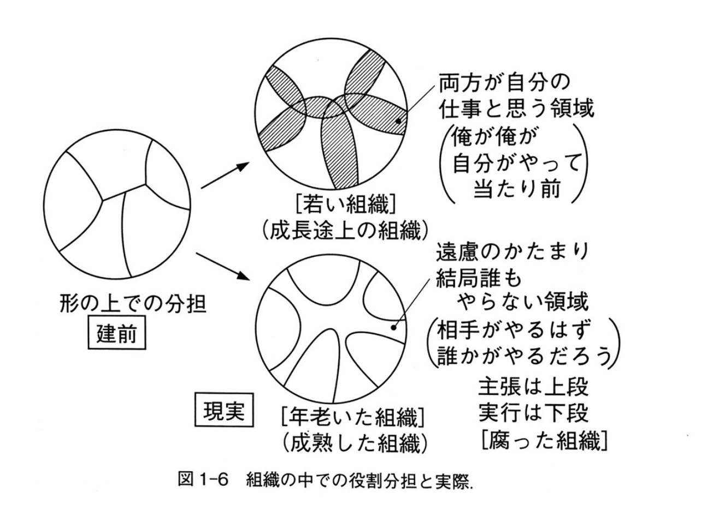

# 高校の紹介

~~休暇エピソードを話そうかなと思っていましたが~~
~~あまり紹介するような出来事がなかった~~

---

トホホな高校の不思議
（ミステリー・ホラーとかに近い）

---

ざっくり概要

- 集団下校を推奨！高校生が近隣の中学生にカツアゲされる 💴
- 市街地にある空港の醍醐味！飛行機が車道にオーバーラン。福岡空港ガルーダ航空機離陸事故 [^1]。空港は高校から数km 🛬
- 消えた「エアマックス95 イエローグラデ」 👟
- 毎年変わるサッカー部のユニフォーム メーカーと監督の外車。勝利給もあり ⚽️
- 席取りは窓から 🚃
- 高校の売店で、サッカー日本代表とツナサンド争奪戦！🥐

[^1]: https://ja.wikipedia.org/wiki/%E7%A6%8F%E5%B2%A1%E7%A9%BA%E6%B8%AF%E3%82%AC%E3%83%AB%E3%83%BC%E3%83%80%E8%88%AA%E7%A9%BA%E6%A9%9F%E9%9B%A2%E9%99%B8%E4%BA%8B%E6%95%85

---

アイスが凍るような話が続きそうなのでこの辺で、、、🍨

---

# ITがつまらないが話題

---

- [ITが面白い時代はすでに終わっているし変化も遅くなった](https://nowokay.hatenablog.com/entry/2024/08/21/002459)

- [ITがつまらんとか言ってるのは老害だけ](https://blog.satotaichi.info/Only_old_fossils_say_IT_is_boring/)

- [なんか「ITがつまらなくなった」叩かれすぎてムカついたので書いてみる](https://anond.hatelabo.jp/20240818145106)

---

一部を簡単に訳すると

- 昔はゲームのエンジンをゴリゴリ書いていた。
- Unity や Unreal Engine によってコモディティ化されて職人芸が無効化されたニャーん。

---

[【ビジネスパーソンこそ遊べ】自分をハッピーにするアロハ記者流仕事術／幸せは仕事・勉強・遊びの大三角形の中に／仕事に読書が必要な理由／遊ぶ計画から立てよ／苦しい仕事を楽しくするには【近藤康太郎】](https://youtu.be/R6R3On17as4?feature=shared)

---

1. 人生は仕事が大半。
    - 認めたくはないが、大半の人が当てはまる
1. やらされる仕事は楽しくない
1. 逆に、仕事が楽しければ人生の大半は楽しい
1. 仕事の中でやりたいことを始める
1. 仕事の中でやりたい事の比率を増やす
1. 徐々に楽しくなる
1. チャレンジ（やりたい放題）したければ、学びが必要になる
1. 学ぶ

---

- 古典を読む
    - [技術の創造と設計](https://amzn.asia/d/fzFVqNi)

---

組織構造について、詳しくは [@kumagi](https://twitter.com/kumagi?ref_src=twsrc%5Egoogle%7Ctwcamp%5Eserp%7Ctwgr%5Eauthor) さんの [mond](https://mond.how/ja/topics/5i49gd7avszd8zd/drq1j9na68nz8kp) を参照

---

やりたい仕事がないと感じたら境界を越える

- 余白が見つかる
- 自分がやって当たり前
- 境界を越える（部署を越える場合は、マネージャーに相談した上で）
- 誠意を持って話し合う
- チャレンジの連続
- 今の知識では不足し始める
- 学ぶ

---

<!--
_backgroundColor: #f04600
-->

- 余白が見つかる
- 自分がやって当たり前
    ### Take Ownership
- 境界を越える（部署を越える場合は、マネージャーに相談した上で）
    ### Beyond Boundaries
- 誠意を持って話し合う
    ### Integrity Driven
- チャレンジの連続
    ### Playful Challenge
- 今の知識では不足し始める
- 学ぶ

---

- 自分で始めて🏃‍♀️
- 自分からハマって🕳️
- 自分で解決💡
- 自作自演🤭

---

## 健康第一

- 自分の機嫌は自分で取る

---

以上

---

次は平本さんが出演する？
